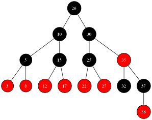

# red-black-tree-visualization
This project provides a **Red-Black Tree visualization** using **Graphviz** and **Python**. The script generates a graphical representation of a Red-Black Tree and saves it as a PNG image.

## 🛠 Installation & Usage

### **1️⃣ Clone the repository**

`git clone https://github.com/konstrot/red-black-tree-visualization.git`

### **2️⃣ Install dependencies**

Ensure you have Python 3.8+ installed. Then, install Graphviz:

```bash
pip install graphviz
```

You can download Graphviz from the official website: [https://graphviz.org/download/](https://graphviz.org/download/)

### **3️⃣ Run the script**

You need to run the script from the `PNG` directory to ensure that PNG images and DOT notation files are created in this folder.

```bash
cd PNG
python ../test_rbt.py
```

This will generate Red-Black Tree visualizations and save them as PNG files in the `PNG` directory.

After execution, multiple PNG files may open automatically. You can close them as a group and later view individual graph images as needed.

---

## 📌 Example Output

The script generates a visualization of a Red-Black Tree.

Example output (auto-generated PNG file):



---

## 📜 License

This project is licensed under the **MIT License**.

